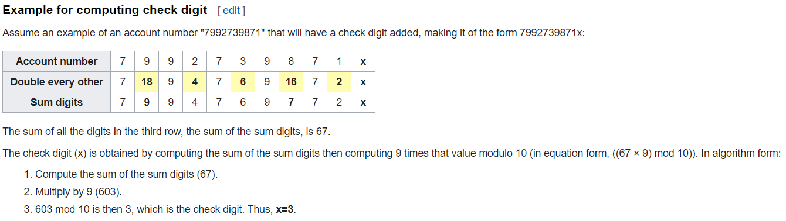

# luhn
Uses Luhn algorithm to validate and generate valid credit card numbers.

Rexx is a scripting language that works with a mainframe, thus a mainframe is needed to properly access the input/output files.

The key to create a number that satisfies the Luhn algorithm is to implement its checksum formula, in which the last digit, also known as the check digit, must match the formula's calculations. In the generator code, the algorithm is reversed engineered and instead utilizes the checksum formula to generate the check digit, resulting in a number that satisfies the Luhn algorithm.

(Source: Wikipedia)

